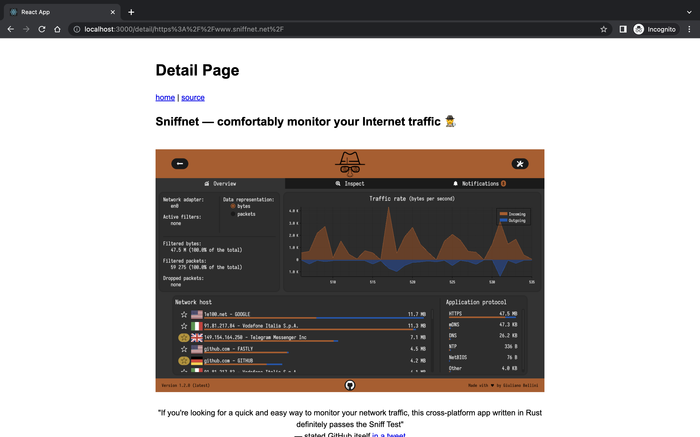
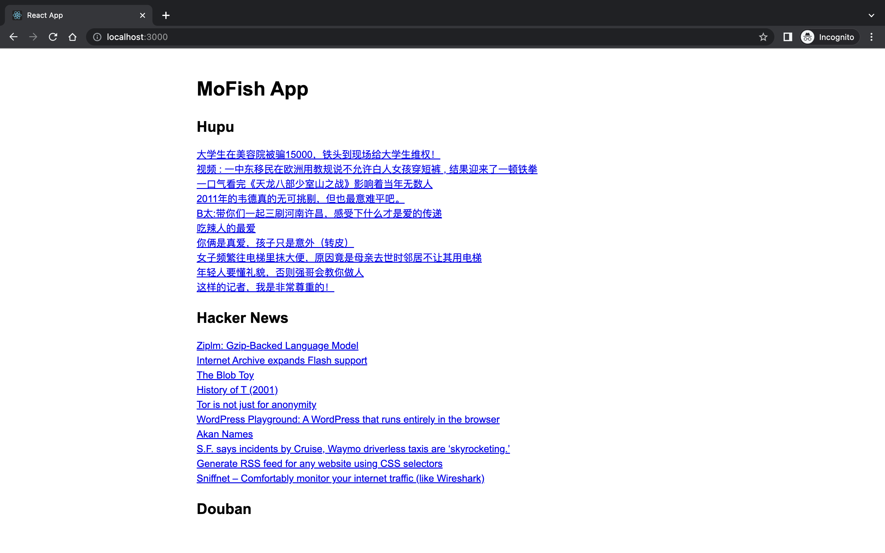

# mofish 

get site hot list. (Rust)

- [x] HackerNews
- [x] Hupu
- [x] Douban

## ScreenShot



## RUN

### Backend
```
cargo build --release

./target/release/mofish -h
```

### Frontend
```
cd mofish_front && npm install && npm start
```
